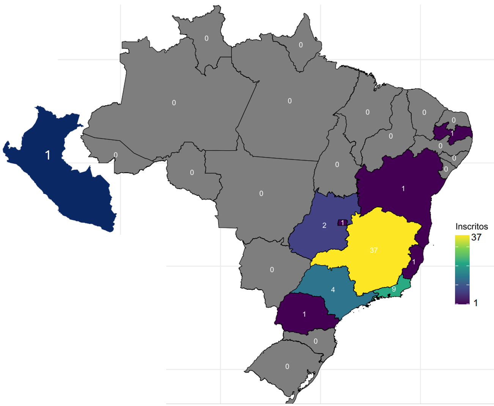
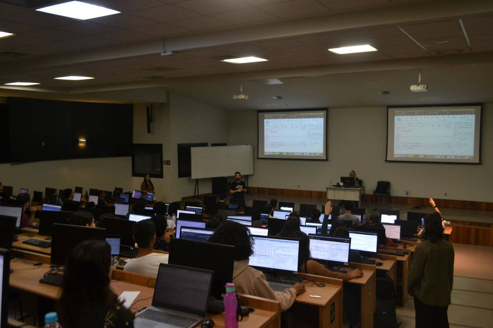
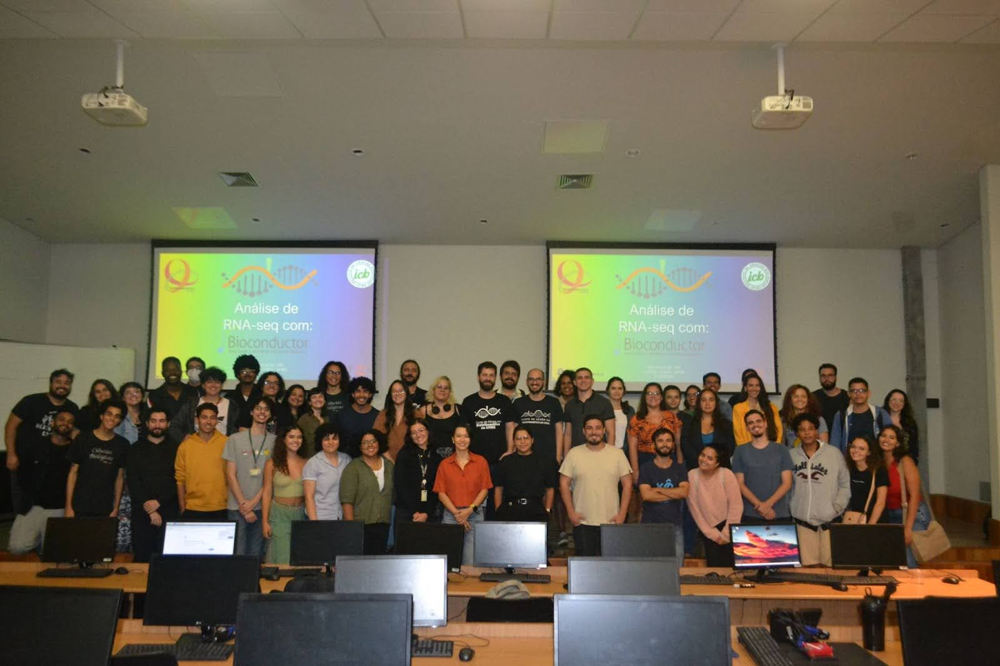

We are thrilled to share that we recently organized the first Bioconductor (bioC-RNAseq) course in the state of Minas Gerais—one of the few such events ever held in Brazil.

The course took place at the Federal University of Minas Gerais (UFMG), supported by the graduate programs in Bioinformatics and in Biochemistry & Immunology. It was part of the 10-year anniversary edition of the Bioinformatics Summer Course.

Our experience in organizing this course builds upon insights from our publication, _“From In-Person to the Online World: Insights Into Organizing Events in Bioinformatics”_. A key highlight was the collaboration between departments at Instituto de Ciências Biológicas (ICB) and Departamento de Ciência da Computação/Instituto de Ciências Exatas (DCC/ICEx), fostering interdisciplinary learning and research.

## Instructors

- **Izabela Mamede**: MSc in Biochemistry and Immunology at UFMG. Bachelor’s in Biological Sciences from UFMG. Certified Carpentries instructor ([GitHub](https://github.com/izabelamc)).
- **João Paulo P. de Almeida**: Postdoctoral researcher at the Institute of Biological Sciences and the Center for Artificial Intelligence Applied to Health, UFMG. PhD in Bioinformatics from UFMG and MSc in Biochemistry from the Ribeirão Preto Medical School, University of São Paulo (2018). ([GitHub](https://github.com/jppalmeida)).

## Monitors

- **Carlos A. da M. Machado** – Undergraduate student, Biological Sciences, UFMG.  
- **Victor A. Rogana** – Undergraduate student, Biological Sciences, UFMG.  
- **Bárbara Marinho** – Undergraduate student, Biomedical Sciences, UFMG.  
- **Clarisse R. Reis** – Master’s student, Graduate Program in Biochemistry and Immunology, UFMG.  
- **Henry P. G. Neto** – PhD student, Graduate Program in Genetics, UFMG.  

## Course Content

In this course, we integrated the Carpentries bioC-RNAseq lesson with the tidyomics syntax, particularly [`tidybulk`](https://github.com/stemangiola/tidybulk). This intensive one-day event spanned eight hours and covered essential topics in RNA sequencing data analysis using R.

The course took place in an auditorium equipped with 120 Raspberry Pi 3 Model B+ computers. All participants had Wi-Fi access and a pre-configured connection to a local server with 300 GB of RAM and 24 CPUs, maintained by Professor Glória R. Franco’s group (UFMG). The server, which included all necessary packages for the course, was prepared with the support of Lucio Rezende Queiroz, a researcher at Weill Cornell Medicine. ([GitHub](https://github.com/luciorezende))

We had a total of 58 participants coming from 8 different Brazilian states and one from Peru (Figure 1). Our team of five monitors played a key role in troubleshooting small coding issues and keeping the course running smoothly in a large in-person classroom.

**Figure 1** - Map of Brazil showing the number of course participants per state.  

The audience ranged from university professors to undergraduate students across various life science disciplines, including health and agricultural sciences. No prior experience in R was required. Over **14k lines of code** were typed during the course, and our local server reached its **full CPU capacity** when all participants ran the `lfcShrink` function simultaneously!

The feedback was overwhelmingly positive, highlighting a clear demand for more courses like this. Many participants reached us via Instagram, requesting an online version. Given this strong interest, we plan to organize an online edition in the second semester of this year. Stay tuned!

**Figure 2** - View of the Computational Lab Classroom at CAD3, UFMG, during the course.  

**Figure 3** - Final group photo with students, monitors, and instructors.  

