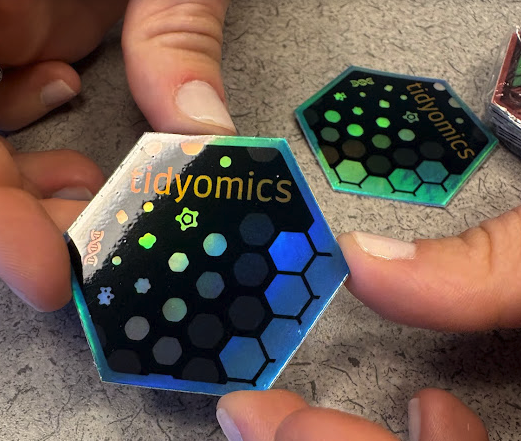

# Join us in Turku

The Tidyomics community is organising a hackathon during the pre-conference programme of [EuroBioC2026](https://eurobioc2026.bioconductor.org/) in Turku, Finland. The hackathon will take place on **June 1-2, 2026**, ahead of the main EuroBioC2026 conference on **June 3-5, 2026**.

This is a community event for people who build, use, teach, document, or are curious about tidy interfaces for omics data analysis in R. Whether you are a regular contributor or new to Tidyomics, the hackathon is a chance to meet collaborators, turn ideas into concrete issues, and make progress on packages, tutorials, and documentation together.

Grab your Tidyomics stickers during the conference! Thanks to Bea Campillo Minano for printing them.

{.cover-image width=70% fig-align="center"}

# What we will work on

The hackathon will focus on practical, community-led work across the Tidyomics ecosystem. Possible projects include:

- fixing bugs and closing issues across Tidyomics packages
- implementing new features and workflow improvements
- improving documentation, tutorials, and vignettes
- developing examples that make tidy omics workflows easier to learn and reuse

The [Tidyomics open challenges board](https://github.com/orgs/tidyomics/projects/1) will be the main source of ideas for the hackathon. Before the event, please browse the board and identify problems or projects you would like to work on.

# How to participate

Please start from the [Tidyomics Hackathon Turku 2026 GitHub repository](https://github.com/tidyomics/tidyomicsHackathonTurku2026). The repository includes event details, preparation steps, and space for participants to open or discuss hackathon issues.

Before the event:

1. Browse the [Tidyomics open challenges](https://github.com/orgs/tidyomics/projects/1).
2. Select a problem you are interested in.
3. Open an issue in the [hackathon repository](https://github.com/tidyomics/tidyomicsHackathonTurku2026), or comment/react if an issue already exists.
4. Join the community discussion in the [EuroBioC2026 Turku hackathon Zulip channel](https://community-bioc.zulipchat.com/#narrow/channel/595963-eurobioc2026-turku-hackathon).

Groups and projects will be finalised during the first day, based on open issues, participant interest, and available expertise.

# Communication

The official discussion space for the hackathon is the [EuroBioC2026 Turku hackathon channel on the Bioconductor Zulip server](https://community-bioc.zulipchat.com/#narrow/channel/595963-eurobioc2026-turku-hackathon). The virtual meeting room link will also be shared through that channel and by email.

If you are attending EuroBioC2026 online, note that the conference provides [free live streaming](https://eurobioc2026.bioconductor.org/) for remote participants.

{width=35% fig-align="center"}

# People

The hackathon was proposed by **Nicholas Cooley**.

The organising committee is:

- Juan Henao
- Stevie Pederson
- Michael Love
- Nicholas Cooley

# See you there

EuroBioC2026 is an opportunity to bring the Bioconductor and Tidyomics communities together around shared tools, shared challenges, and shared documentation. We hope to see you in Turku, on Zulip, and in the hackathon repository.
