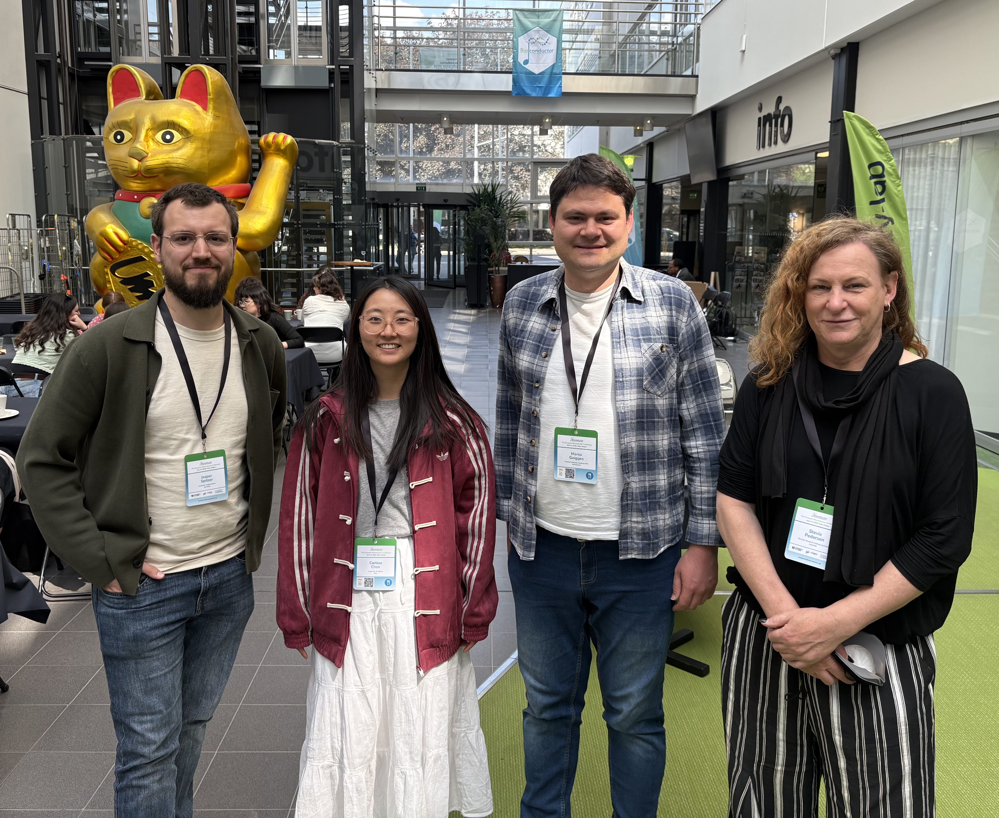
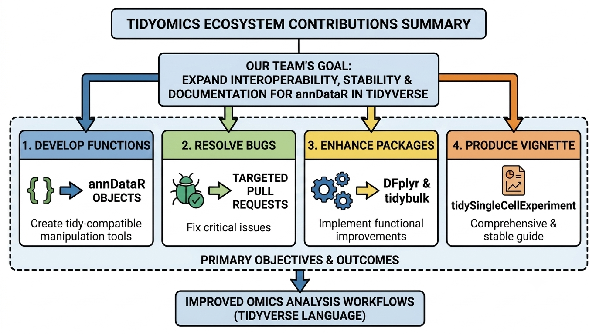

# Two days, four participants, four aims

The first `Tidyomics` community hackathon took place on 1st and 2nd June in Turku, Finland, as part of the **EuroBioC2026** conference pre-events. Here, four researchers from around the globe joined efforts to extend the capabilities of tidy operations for omics data, focusing on solving current bugs.

Concretely, the hackathon focused on four key aspects:

1. Development
2. Bugs
3. Enhancements
4. Learning

# What's new?

The advances produced during this hackathon are available and described in detail in the [BioHackrXiv](https://osf.io/preprints/biohackrxiv/cd9s6_v1) publication. In summary:

1. `tidyAnnData` has been introduced as a new package to provide tidy operations for AnnData objects generated by the `anndataR` package
2. Information access to core `Tidyomics` packages was inconsistent and some links were broken in the main GitHub page; taking advantage of this hackathon, access to correct information was restored
3. The `DFplyr` package was enhanced by improving current methods (e.g. `GroupedDataFrame` and `count.DataFrame`) and making them suitable for universal column names
4. The `tidybulk` package was enhanced to adjust the `lfcShrink()` function to use the different available methods (`apeglm` and `ashr`) and to generate a reduced dimensionality-based plot (PCA) for visual inspection of e.g. batch effects and outlier detection
5. A standardised vignette for `tidySingleCellExperiment` has been developed to provide an extensive and concise guide for new users, encompassing both examples comparable to base R code and best practices on single-cell analysis using tidy operations

# What's next?

Five major contributions in two productive days is all a win!

Beyond this wonderful experience, there is work to do: finalising the development of `tidyAnnData` to make it publicly available, fixing additional bugs and enhancing current packages, and standardising the rest of the `Tidyomics` packages' vignettes. These efforts open the doors for future events and continuing open-science work.

We look forward to seeing you at the coming `Tidyomics` hackathon events to speed up software development, bug fixing, and new material development from [open problems in Tidyomics](https://github.com/orgs/tidyomics/projects/1), or to work on your own ideas for providing tidy operations in omics data analysis.