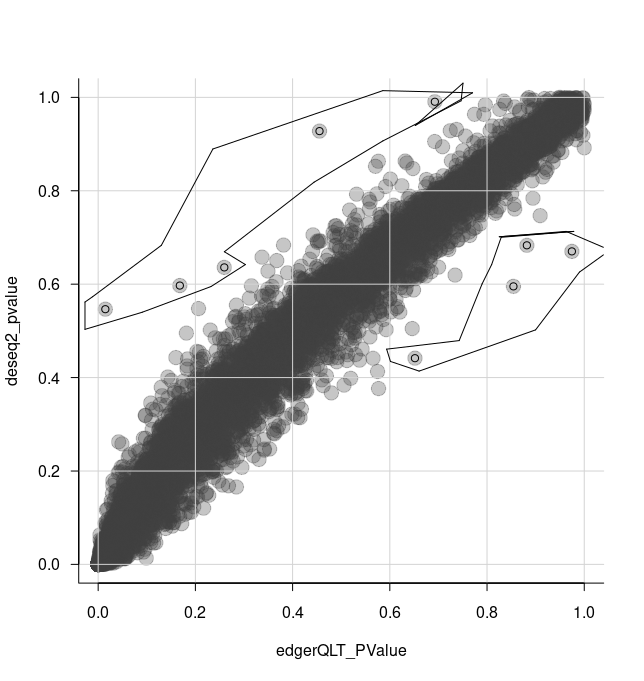

```{r, include = FALSE}
knitr::opts_chunk$set(
  collapse = TRUE,
  comment = "#>"
)

# bibliography: "`r file.path(system.file(package='tidytranscriptomics', 'vignettes'), 'workshop_1_hour.bib')`"

```

Recommended Background Reading
[Introduction to R for Biologists](https://melbournebioinformatics.github.io/r-intro-biologists/intro_r_biologists.html)

```{r, echo=FALSE, out.width = "200px"}
knitr::include_graphics("../inst/vignettes/tidybulk_logo.png")
```

```{r}
library(dplyr)
library(tidyr)
library(forcats)
library(purrr)
library(ggplot2)
library(forcats)
library(GGally)
library(tidygate)
library(plotly)
library(tidybulk)

```

```{r, echo = FALSE}
custom_theme = 	
  list(
  	theme_bw() +
  	theme(
  		panel.border = element_blank(),
  		axis.line = element_line(),
  		panel.grid.major = element_line(size = 0.2),
  		panel.grid.minor = element_line(size = 0.1),
  		text = element_text(size=12),
  		legend.position="bottom",
  		aspect.ratio=1,
  		strip.background = element_blank(),
  		axis.title.x  = element_text(margin = margin(t = 10, r = 10, b = 10, l = 10)),
  		axis.title.y  = element_text(margin = margin(t = 10, r = 10, b = 10, l = 10)),
  		axis.text.x = element_text(angle = 90)
  	),
	  scale_color_brewer(palette = "Set1"),
  	scale_fill_brewer(palette = "Set1")
  )
```

## Introduction

*tidybulk* integrates several popular methods for differential transcript abundance testing: the edgeR quasi-likelihood [@chen2016reads] (tidybulk default method), edgeR likelihood ratio [@mccarthy2012differential], limma-voom [@law2014voom] and DESeq2 [@love2014moderated]. A common question researchers have is which method to choose. Mike Love, DESeq2 author has this advice in his [blog](https://mikelove.wordpress.com/2016/09/28/deseq2-or-edger).

### Comparison of methods
We can serially perform differential analyses with several methods, which results will be added to the original datasets. 

We first pre-process the data, creating a tibble and identifying abundant genes.
```{r}
pasilla_de <- 
  rpharma2020tidytranscriptomics::pasilla %>% 
  
  # Convert SummarizedExperiment object to tibble
  tidybulk() %>%
    
  # Add gene symbols
  mutate(symbol = AnnotationDbi::mapIds(org.Dm.eg.db::org.Dm.eg.db,   keys=as.character(feature), keytype = "FLYBASE", column="SYMBOL", multiVals = "first")) %>%
  
  # Filter counts
  keep_abundant(factor_of_interest=condition)
```

This is an example for the default method for differential abundance testing as we saw previously with the airway dataset. It uses the edgeR quasi-likelihood method.

```{r}
pasilla_de %>%
  
  # Test differential composition
  test_differential_abundance(
    ~ condition + type, 
    action="get"
  ) %>%
  
  # Sort by P value        
  arrange(PValue)
```

Now let's try to perform multiple methods to the same dataset.
```{r}
de_all <- 
  
  pasilla_de %>%
  
  # edgeR QLT
  test_differential_abundance(
    ~ condition + type, 
    method = "edger_quasi_likelihood",
    prefix = "edgerQLT_"
  )  %>%
  
  # edgeR LRT
  test_differential_abundance(
    ~ condition + type, 
    method = "edger_likelihood_ratio",
    prefix = "edgerLR_"
  )  %>%
  
  # limma-voom
  test_differential_abundance(
    ~ condition + type, 
    method = "limma_voom",
    prefix = "voom_"
  ) %>%
  
  # DESeq2
  test_differential_abundance(
    ~ condition + type, 
    method = "deseq2",
    prefix = "deseq2_"
  ) 

# take a look
de_all
```
***

>Note 
>You may notice that the methods produce columns with different names for similar outputs. If you wish to make these consistent you can do that with tidyverse `rename`. For example, to rename the p value adjusted columns you could run below.
>de_all %>% rename(deseq2_FDR = deseq2_padj, voom_FDR = voom_adj.P.Val)

***

We can visually compare the log fold change (logFC) of transcript abundance for the comparison of interest (treated vs untreated) for all methods. We will notice that the consistency of the logFC is really high for the methods.

```{r}
de_all %>%
  pivot_transcript() %>%
  select(edgerQLT_logFC, edgerLR_logFC, voom_logFC, deseq2_log2FoldChange, feature) %>%
  ggpairs(1:4)
```

Similarly, we can visually compare the significance for all methods. In this case the difference is larger.

```{r}
de_all %>%
  pivot_transcript() %>%
  select(edgerQLT_PValue, edgerLR_PValue, voom_P.Value, deseq2_pvalue, feature) %>%
  ggpairs(1:4)
```


We can select some of the transcripts for further analysis using the [*tidygate*](https://github.com/stemangiola/tidygate) package.

With tidygate, we can interactively draw gates to select points we want using `gate`. We specify which columns we want to plot in the scatterplot, and how many gates we want to draw. We can also specify the opacity if we want to make it easier to see overlapping points.

```{r, eval=FALSE}
de_gate <- 
  de_all %>%
  
  gate(
    feature,
    edgerQLT_PValue, 
    deseq2_pvalue, 
    opacity=0.3, 
    how_many_gates = 2 
  )
```

We then click to draw gates around the points we want, for example as shown in the screenshot below. That will add a column called gate, specifying which gate the points (transcripts) are in.


```{r, echo=FALSE}

de_gate = 
  de_all %>%
  
  keep_abundant() %>%
  
  gate(
    feature,
    edgerQLT_PValue, 
    deseq2_pvalue, gate_list = tidytranscriptomics::de_gate_gates
  )

de_gate

```

```{r, echo=FALSE}

```

We can check how many transcripts we've got in each gate.

```{r}
de_gate %>% 
    pivot_transcript() %>% 
    dplyr::count(gate)
```

We can now select the transcripts from our two gates i.e. more significant in edgeR (gate 1) and more significant in DESeq2 (gate 2).

```{r}
de_gate %>% 
    
  # Generate scaled counts for plotting     
  scale_abundance() %>%
  
  # Filter for transcripts within the gates
  filter(gate > 0) %>% 
  
  # Rename for clarity
  mutate(gate = case_when(
    gate == 1 ~ "more in edgeR",
    gate == 2 ~ "more in DESeq2",
    TRUE ~ gate
  )) %>%
  
  # Order the plots for the transcripts
  mutate(feature = fct_reorder(feature, edgerQLT_PValue, min)) %>%
  
  # Plot
  ggplot(aes(condition, counts_scaled, color=gate)) +
  geom_point() +
  facet_wrap(~feature, scale="free_y") +
  custom_theme
```


This enables us to see, for example, that DESeq2 produces a more conservative logFC statistic for the transcript `FBgn0052939` .

```{r}
de_gate %>%
  pivot_transcript %>%
  filter(feature == "FBgn0052939")%>%
  select(edgerQLT_logFC, deseq2_log2FoldChange)
```


## Contributing
If you want to suggest improvements for this workshop or ask questions, you can do so as described [here](https://github.com/stemangiola/tidytranscriptomics/blob/master/CONTRIBUTING.md).

## Reproducibility
Record package and version information with `sessionInfo`

```{r}
sessionInfo()
```

## References
